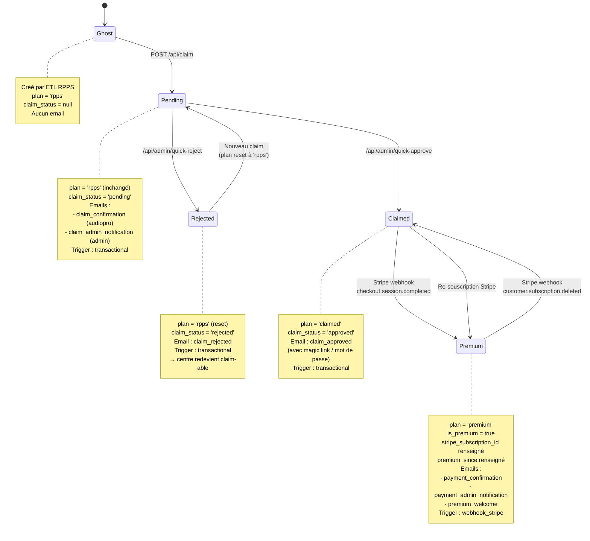
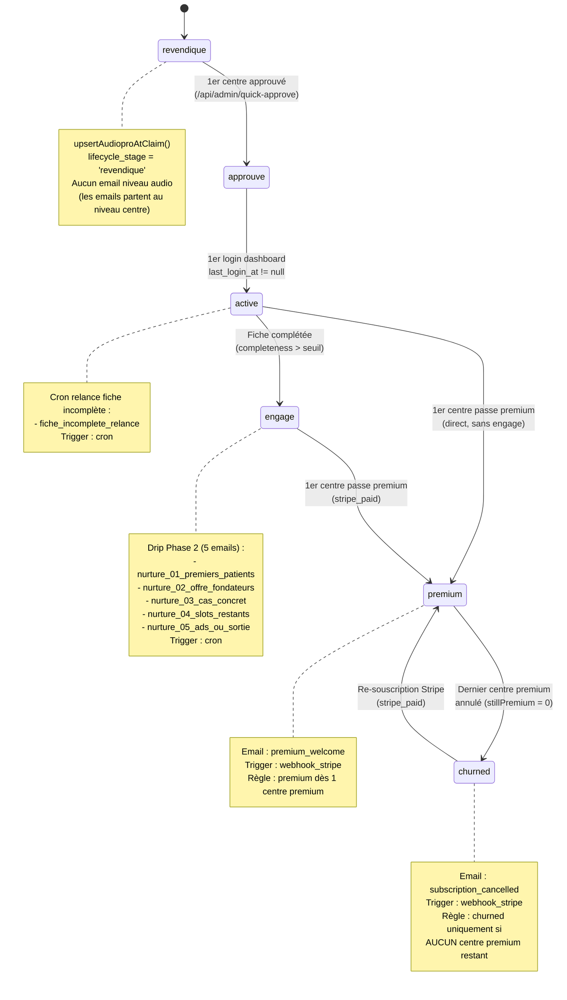
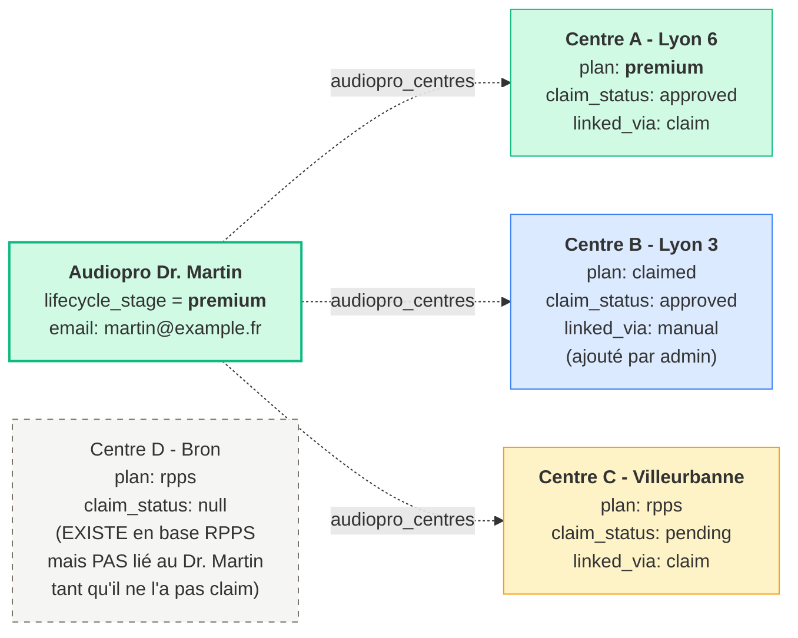

# Cycle de vie des fiches centre auditif

Architecture à **2 lifecycles parallèles** : un par CENTRE (fiche physique), un par AUDIOPRO (compte). Reliés par une table de jointure N–N.

> **Source de vérité code**
> - Centre : `centres_auditifs.claim_status` (`rpps` / `pending` / `approved` / `rejected`) + `centres_auditifs.plan` (`rpps` / `claimed` / `premium`)
> - Audiopro : `audiopro_lifecycle.lifecycle_stage` ([src/types/audiopro-lifecycle.ts:18-24](../src/types/audiopro-lifecycle.ts#L18-L24))
> - Liaison N–N : `audiopro_centres` (`linked_via: 'claim' | 'manual'`)
> - Templates email : [src/emails/](../src/emails/) (15 templates)
> - Helpers transitions : [src/lib/audiopro-lifecycle.ts](../src/lib/audiopro-lifecycle.ts)
> - Webhook Stripe : [src/pages/api/webhook.ts](../src/pages/api/webhook.ts)

---

## Vue d'ensemble : pourquoi 2 lifecycles ?

| Niveau | Identifiant | Plan/Stage | Cardinal |
|---|---|---|---|
| **CENTRE** | `slug` (RPPS) | `plan` indépendant par fiche | 7654 fiches |
| **AUDIOPRO** | `email` | `lifecycle_stage` agrégat sur ses centres | N personnes |

**Règle clé** : un audiopro peut détenir **plusieurs centres dans des états différents**. Son `lifecycle_stage` est **l'état max** sur l'ensemble de ses centres :
- Passe `premium` dès qu'**au moins 1** centre devient premium ([webhook.ts:193](../src/pages/api/webhook.ts#L193))
- Passe `churned` **uniquement si plus aucun** centre premium n'est lié ([webhook.ts:290-321](../src/pages/api/webhook.ts#L290-L321), check `stillPremium === 0`)
- Ne **régresse jamais** sur un re-claim d'un autre centre ([audiopro-lifecycle.ts:84](../src/lib/audiopro-lifecycle.ts#L84) — préserve `first_claim_at`, ne touche pas au stage)

---

## A. Cycle de vie d'un CENTRE

---

## B. Cycle de vie d'un AUDIOPRO

**Important** : un audio `premium` qui re-claim un Nème centre **ne régresse pas** vers `revendique` — son stage reste `premium`. Le nouveau centre, lui, démarre son propre cycle (Ghost → Pending → ...).

---

## C. Relation N–N : un audiopro multi-centres

Cas concret : Dr. Martin détient 4 centres physiques. Voici l'état possible à un instant T.

**Lecture** :
- Le Dr. Martin est `premium` parce qu'**au moins un** de ses centres (A) l'est.
- Si A perd son premium et que ni B ni C ne sont premium → le Dr. Martin passe `churned`.
- Si C est rejeté en validation admin → C bascule en `Rejected`, mais l'audio reste `premium` (ni régression, ni promotion sur l'audio).
- Le centre D existe dans la base RPPS mais n'apparaît pas dans le réseau du Dr. Martin tant qu'aucune ligne `audiopro_centres` ne le lie. Il est invisible comme "sien" pour le système.

---

## Tableau récapitulatif des emails

### Emails déclenchés par événement CENTRE

| Événement | Centre avant → après | Email(s) | Trigger | Destinataire |
|---|---|---|---|---|
| ETL RPPS (création) | — → `rpps` | — | — | — |
| Claim soumis | `rpps` → `pending` | `claim_confirmation` + `claim_admin_notification` | `transactional` | Audiopro + Admin |
| Rejet admin | `pending` → `rejected` | `claim_rejected` | `transactional` | Audiopro |
| Approbation admin | `pending` → `claimed` | `claim_approved` | `transactional` | Audiopro |
| Stripe paiement | `claimed` → `premium` | `payment_confirmation` + `payment_admin_notification` | `webhook_stripe` | Audiopro + Admin |
| Stripe annulation | `premium` → `claimed` | `subscription_cancelled` | `webhook_stripe` | Audiopro |

### Emails déclenchés par état AUDIOPRO

| État audiopro | Email(s) | Trigger | Condition de déclenchement |
|---|---|---|---|
| `revendique` | — | — | — |
| `approuve` | — | — | — |
| `active` | `fiche_incomplete_relance` | `cron` | Si centre lié a `completeness < seuil` |
| `engage` | `nurture_01..05` (5 emails séquentiels) | `cron` | Drip Phase 2, espacés dans le temps |
| `premium` | `premium_welcome` | `webhook_stripe` | À la transition (1 fois) |
| `churned` | (`subscription_cancelled` déjà envoyé au niveau centre) | `webhook_stripe` | Aucun email supplémentaire au niveau audio |

### Email hors-cycle

| Email | Trigger | Usage |
|---|---|---|
| `nouvel_espace_pro_annonce` | `manual_admin` | Campagne one-shot (lancement espace pro), envoyée à l'ensemble des audiopros existants |

---

## Notes architecturales

### Idempotence

- `upsertAudioproAtClaim()` réutilise un audio existant si l'email est déjà connu, sans écraser `first_claim_at` ni `lifecycle_stage`.
- `transitionLifecycleStage()` est no-op si le stage cible est déjà atteint.
- `claim_attributions` est append-only : chaque tentative de claim (même après rejet) conserve sa source d'origine pour l'attribution multi-touch.
- Le webhook Stripe `checkout.session.completed` vérifie `centre.plan === 'premium'` avant update → re-fire = no-op.

### Asymétrie des transitions audio

L'audio progresse `revendique → approuve → active → engage → premium` mais **ne régresse jamais** dans la chaîne, sauf vers `churned` (terminal). Implication :
- Un audio `premium` qui re-claim un nouveau centre : reste `premium`, le centre démarre un cycle indépendant.
- Un audio `engage` dont le seul centre est rejeté : reste `engage` (l'historique l'emporte).
- Un audio `premium` qui perd son dernier centre premium : passe directement `churned` (skip `engage` et `active`).

### Sécurité & gating

- Approbation/rejet admin via tokens signés à usage unique (`generateAdminToken`) — liens one-click dans `claim_admin_notification` ([api/claim.ts:264-270](../src/pages/api/claim.ts#L264-L270)).
- `centre.plan === 'rpps'` est une condition nécessaire pour démarrer un claim ([api/claim.ts:88-93](../src/pages/api/claim.ts#L88-L93)) — empêche le double-claim.
- `centre.claim_status === 'pending'` bloque un nouveau claim concurrent ([api/claim.ts:95-100](../src/pages/api/claim.ts#L95-L100)).
- `is_demo=true` exclut une fiche du parcours de revendication ([api/claim.ts:81-86](../src/pages/api/claim.ts#L81-L86)).

### Liaison `linked_via`

La table `audiopro_centres` distingue 2 modes de liaison :
- `'claim'` : liaison créée automatiquement au moment du claim user.
- `'manual'` : liaison créée par un admin (cas typique : audio multi-cabinets qui n'a claim qu'un seul site, l'admin lui rattache les autres).

Conséquence : un audio peut posséder un centre `linked_via='manual'` qu'il n'a JAMAIS personnellement revendiqué via le formulaire.

### Tracking conversion

À chaque claim (audiopro consentant) :
- Cookie `lga_attr` (90j) → ligne `claim_attributions` (UTM, gclid, fbclid, referrer, landing_page, ga_client_id).
- Si consent `!gtag=true` → event GA4 Measurement Protocol serveur `revendication_success`.
- L'email pipeline log dans `email_events` (delivered / opened / clicked / bounced) — base de pilotage du drip Phase 2.
